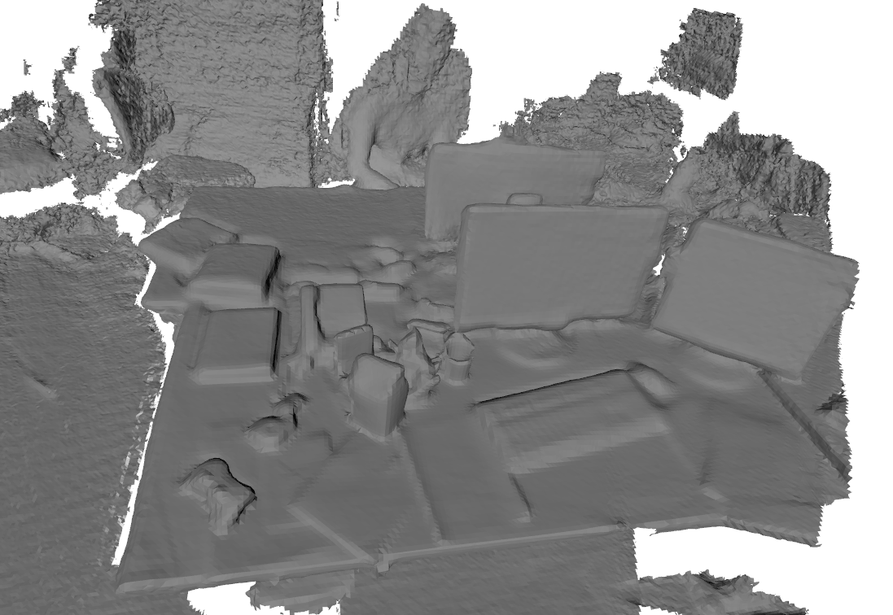

Python bindings to voxelize RGB-D images
===

This repo contains a python binding for voxelization: a routine to register RGB-D images into voxel maps. Note that this is a GPU only implementation so you will need to have a CUDA capable GPU to run it.

## Installation

Normally `pip install .` would be sufficient to install the module, but you have to make sure that all the dependant packages are installed in your system. Please refer to [`voxelization/README.md`](./voxelization/README.md) for more details on the packages. 

## Example

An interactive example is provided in `./example/fuse_map_tum_full` which show case the library's ability to reconstruct a full TUM rgbd sequence. Note that additional dependancies might be required to run the script.